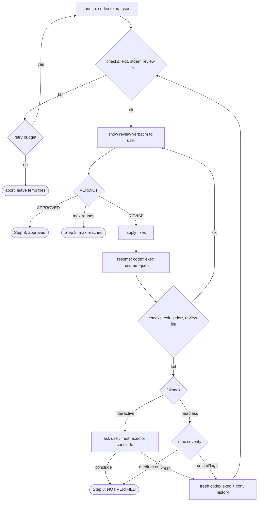

# Design Notes — adversarial-review

This document records the *why* behind the current implementation of the
`adversarial-review` skill: the empirical facts about external tools it
depends on, the rationale for each non-obvious design decision, and the
alternatives that were considered and rejected. Read `SKILL.md` for
*what* the skill does step by step; read this file when you need to
understand *why it does it that way* before changing something.

---

## §0. Purpose and audience

### Why this file exists

The skill orchestrates two AI systems (Claude as the lead, OpenAI Codex
as the external reviewer) through a CLI subprocess interface. The
observable behavior of the skill depends on details of the Codex CLI
(stream splitting, exit codes, flag support), on details of the
Claude Code harness (Bash-tool output size, Opus interpretation of
instructions), and on a set of trade-offs between token cost,
robustness, and operator ergonomics. Those details drift with each new
Codex release and each new Claude model version. A maintainer reading
only `SKILL.md` sees the instructions but not which facts are
load-bearing and which are historical accidents — and so may undo a
subtle fix during a refactor.

This file fixes that. It names the facts, the decisions, the rejected
alternatives, and — importantly — the prior diagnostic reports that
turned out to be wrong. The goal is that a contributor six months from
now can change the skill confidently instead of re-discovering the
terrain.

### Audiences

1. **A future Claude** resuming work on the skill in a fresh session.
   It knows Claude Code in general but has no memory of the discussion
   that produced the current design.
2. **A human developer** who knows git and bash but does not know the
   Claude Code internals or the Codex CLI quirks.
3. **A contributor** who wants to add a feature (new reviewer backend,
   CI integration) and needs to know what invariants to preserve.

### What this file is NOT

- Not a user guide — that is `README.md`.
- Not authoritative on current behavior — `SKILL.md` is. This file
  explains why `SKILL.md` is written the way it is. If the two
  disagree, `SKILL.md` wins; fix this file.

### How to use this file

If you are about to modify the skill:

1. Skim `§1. System context` to recall the flow.
2. Find the step you want to change in `§4. Design decisions` — each
   decision lists which `SKILL.md` step it ties into.
3. Check `§2. Codex CLI empirical facts` for the environment
   assumptions you are about to lean on. If the date in `§8. Version
   and verification log` is older than a few Codex releases, re-verify
   before trusting.
4. Run `§7. Smoke test protocol` before and after your change. If the
   before-run already fails, stop and investigate — don't layer a
   change on top of undetected drift.

---

## §1. System context

### One paragraph

`adversarial-review` is a Claude Code skill. The user types
`/adversarial-review` in a Claude Code session; Claude (the "lead")
writes an adversarial review prompt to a temp file, launches
`codex exec` as a subprocess with the prompt on stdin, and captures the
reviewer's response to a `-o` file. Claude then shows the review to the
user verbatim, applies fixes to the plan or code, and re-submits the
revised state to the reviewer through `codex exec resume`. The loop
runs up to five rounds, or until the reviewer emits
`VERDICT: APPROVED`.

### Roles

- **Lead (Claude).** Orchestrator. Reads `SKILL.md`, runs the Bash /
  Write / Read / Edit tools, authors the fixes, decides when to stop.
- **Reviewer (Codex).** External AI process invoked per round. Receives
  the adversarial prompt, reads repo/plan content in a read-only
  sandbox, emits a structured review with `VERDICT:`.
- **User.** Reads the verbatim review Claude shows each round,
  accepts/rejects the skill's final result.

### Flow



The diagram collapses retries and round counting; for the exact
ordering see the strict check lists in `SKILL.md` Steps 4 and 7.

### Why an external reviewer at all

An adversarial review from the *same* model as the writer tends toward
validation bias. Running the review through a different model family
(GPT via Codex CLI) reduces shared blind spots. The cost is an external
dependency and a CLI-level integration — which is exactly what most of
this document exists to manage.

---

## §2. Codex CLI empirical facts (verified on v0.121.0)

All facts in this section were verified on `codex-cli 0.121.0` on
2026-04-17 (see `§8. Version and verification log`). If you are reading
this more than a few Codex releases later, re-verify before relying on
a specific behavior. `§7. Smoke test protocol` is a minimal suite you
can run in a few minutes.

### §2.1. Invocation shapes

Two relevant subcommands:

```
codex exec [OPTIONS] [PROMPT]
codex exec resume [OPTIONS] [SESSION_ID] [PROMPT]
```

Both accept PROMPT either as a trailing argument or as stdin. Two stdin
shapes are accepted by codex itself:

```bash
# A. stdin redirect from file
codex exec ... - < /tmp/codex-prompt-*.md

# B. pipe through cat
cat /tmp/codex-prompt-*.md | codex exec ... -
```

**Both shapes work in some environments; only (B) works reliably in all
observed Claude Code sandboxes.** In at least one sandbox configuration,
form (A) exits 1 with empty stderr (no codex error message) while form
(B) produces an identical `-o` review file. We do not have a root-cause
diagnosis for (A)'s failure — it is consistent across codex 0.120.0 and
0.121.0 in the affected environment, so it is not a codex version issue.
See `§6.6` for the observation log.

The skill therefore uses form (B) as canonical (`§4.1` captures the
decision). Long XML prompts still need file delivery to avoid shell
quoting issues, so the file is written via the Write tool and fed
through `cat | ... -` rather than embedded as a command-line argument.

### §2.2. Output streams

Two output modes, with different stream semantics:

**Default mode (no `--json`):**

- stdout: only the final agent message, plain text. Identical to what
  `-o FILE` writes to disk.
- stderr: a metadata block printed before the agent response, followed
  by a tail including token usage. The metadata block includes the
  line `session id: <uuid>`.

Verify:

```bash
echo "respond PONG" | codex exec -m gpt-5.4 -s read-only \
  -C "$(git rev-parse --show-toplevel)" - > /tmp/a.out 2> /tmp/a.err
cat /tmp/a.err | grep 'session id:'
cat /tmp/a.out
```

**JSON mode (`--json`):**

- stdout: newline-delimited JSONL events. The first event is always
  `{"type":"thread.started","thread_id":"<uuid>", ...}`. Subsequent
  events are `turn.started`, `item.completed`, `turn.completed`, etc.
- stderr: empty on success. Populated only on errors.

Verify:

```bash
echo "respond PONG" | codex exec --json -m gpt-5.4 -s read-only \
  -C "$(git rev-parse --show-toplevel)" - > /tmp/a.out 2> /tmp/a.err
head -1 /tmp/a.out  # expect {"type":"thread.started",...}
wc -c /tmp/a.err    # expect 0
```

**Environment-specific suppression.** In at least one observed Claude
Code sandbox, `--json` stdout is empty (0 bytes) when redirected to a
file, even though the `-o` path is populated correctly and the process
exits 0. The `-o` file has the review, stderr is empty, only stdout
JSONL is missing. This is reproducible across codex 0.120.0 and 0.121.0
in that environment and not reproducible in the reference environment.
Root cause is not diagnosed; see `§6.6` for the observation log. The
skill handles it with a secondary filesystem-based session-id capture
path (`§4.1b`) so resume still works.

**`-o FILE` flag:**

Writes the final agent message to FILE as plain text, *regardless* of
whether `--json` is set. In JSON mode, this is the only way to get a
human-readable review — stdout is machine-readable events only.

### §2.3. Session persistence

Every non-ephemeral `codex exec` run creates a rollout file:

```
~/.codex/sessions/YYYY/MM/DD/rollout-TIMESTAMP-UUID.jsonl
```

Filename format: `rollout-<ISO-8601 timestamp with dashes>-<UUID>.jsonl`.
The UUID is the session / thread id and is accepted verbatim by
`codex exec resume`.

`--ephemeral` disables persistence. Not used by the skill — resume
requires persistence.

**Session-id recovery from the filesystem.** Because the UUID is a
deterministic suffix of the filename, session id can be recovered from
disk after the fact, independent of whether `--json` emitted the
`thread.started` event to stdout. The rollout JSONL body also contains
the initial prompt text — so the skill can positively bind by putting
a unique marker in the prompt (`REVIEW_ID`) and grepping for it
across candidate rollouts, rather than relying on timing alone. The
skill uses this as a secondary capture path (`§4.1b`) when stdout is
empty.

Verify:

```bash
MARKER="PROBE-$(date +%s)-$$"
cat > /tmp/x-prompt.md <<EOF
<!-- ${MARKER} -->
respond PONG
EOF
cat /tmp/x-prompt.md | codex exec -m gpt-5.4 -s read-only \
  --skip-git-repo-check -o /tmp/x.md - >/dev/null 2>&1
ROLLOUT=$(find ~/.codex/sessions -name 'rollout-*.jsonl' \
  -newer /tmp/x-prompt.md \
  -exec grep -l "${MARKER}" {} + 2>/dev/null | head -1)
basename "${ROLLOUT}" .jsonl \
  | grep -oE '[0-9a-f]{8}(-[0-9a-f]{4}){3}-[0-9a-f]{12}'
# expect: a UUID, and that UUID accepted by `codex exec resume`
rm -f /tmp/x-prompt.md /tmp/x.md
```

### §2.4. Resume semantics

```
codex exec resume [OPTIONS] [SESSION_ID] [PROMPT]
codex exec resume --last  # pick newest in cwd
```

**Supported flags (per `codex exec resume --help`):** `--json`, `-o`,
`-m`, `-i`, `--last`, `--all`.

**NOT supported:** `-s` (sandbox inherited from original session; always
`read-only` in this skill), `-C` / `--cd` (cwd is whatever the shell
had when `codex` was invoked — see §2.4.2).

**§2.4.1. `--last` filters by cwd.** `resume --last` only considers
sessions whose rollout records the current cwd. Invoking from one repo
cannot pick up a session in another repo. But within the same cwd, it
picks the *newest* session regardless of origin — including one-shots,
unrelated tool invocations, or user-initiated codex work happening in
parallel.

Verify:

```bash
mkdir -p /tmp/cwd-a /tmp/cwd-b
cd /tmp/cwd-a && git init -q
cd /tmp/cwd-b && git init -q
cd /tmp/cwd-a && echo "respond ALPHA" | codex exec -s read-only \
  --skip-git-repo-check - 2>&1 | grep 'session id:'
cd /tmp/cwd-b && echo "respond BRAVO" | codex exec -s read-only \
  --skip-git-repo-check - 2>&1 | grep 'session id:'
cd /tmp/cwd-a && echo "which?" | codex exec resume --last \
  --skip-git-repo-check - 2>&1 | tail -5
# expect: resumes ALPHA session, not BRAVO
```

**§2.4.2. cwd is inherited from the shell, not the rollout.** The
original `codex exec -C /repo ...` pins the session to `/repo` for its
initial turn. A subsequent `codex exec resume <UUID>` from a *different*
cwd does NOT inherit `/repo`. It either fails with
`Not inside a trusted directory` (exit 1, no `-o` written), or silently
runs with the new cwd. The skill works around this with `cd '<REPO_ROOT>' &&`
as a command prefix before every resume (see `§4.3`).

**§2.4.3. Bad UUID exit code.** `codex exec resume <non-existent-uuid>`
exits with code **1** (not 0). stderr contains:

```
Error: thread/resume: thread/resume failed: no rollout found for thread id <uuid>
```

stdout is empty. `-o` file is NOT created.

Verify:

```bash
echo "hi" | codex exec resume 00000000-0000-0000-0000-000000000000 \
  --skip-git-repo-check - 2>/tmp/e.err
echo "EXIT=$?"           # expect EXIT=1
cat /tmp/e.err           # expect "thread/resume failed..." line
```

**§2.4.4. Thread ID does not rotate across successful resumes.** Each
successful `codex exec resume --json` emits a `thread.started` event
whose `thread_id` equals the original session's UUID. It is *not* a new
id. The skill's rule "update `CODEX_SESSION_ID` on every successful
resume" therefore is functionally a no-op on the current version, but
remains defensive for future Codex versions that might rotate ids.

Verify: compare the UUID in the first `thread.started` event of an
initial `codex exec --json` with the UUID in the first `thread.started`
event of `codex exec resume --json <that-UUID>`. Should be identical.

### §2.5. Known failure modes

| Trigger | Exit code | stdout | stderr | `-o` file |
|---|---|---|---|---|
| Success (reference env) | 0 | final text / JSONL | empty (json) or metadata+token block (non-json) | written |
| Success (affected sandbox, §6.6) | 0 | empty (`--json` suppressed) | empty | written |
| Timeout (wrapped `timeout 600`) | 124 | partial or empty | partial | may be missing or partial |
| Model not available (`-m bogus`) | 1 | empty | error line | not written |
| `-o` path unwritable | 0 | final text / JSONL | `Failed to write last message file ...` line | not written |
| Not in git work tree, no `--skip-git-repo-check` | 1 | empty | `Not inside a trusted directory ...` | not written |
| Resume with bad UUID | 1 | empty | `thread/resume failed ...` | not written |
| `- < file` stdin redirect (affected sandbox, §6.6) | 1 | empty | empty (!) | not written |

The `-o` unwritable case is dangerous: exit code is misleading. The
skill defends by always reading stderr even on exit 0 (see `§4.8`).
The `- < file` exit-1-with-empty-stderr case is why the skill uses
`cat | pipe` instead (see `§4.13`).

### §2.6. CLI gaps relevant to the skill

- `codex exec resume` does not accept `-C`.
- `codex exec resume` did not accept `-o` before issue openai/codex#12538
  was resolved. On current versions it does.
- `codex --version` prints `codex-cli 0.121.0` — not empty, despite one
  earlier agent's diagnostic claim (see `§6`).

---

## §3. Claude Code / harness facts

These facts apply to the Claude Code runtime (the "harness") that
executes the skill, verified during work on this refactor.

### §3.1. Bash tool

- Returns combined stdout + stderr as the tool result text.
- Truncates output at approximately 30 KB. Under truncation, the *tail*
  is retained; the *head* is dropped. This is why Codex's `session id:`
  metadata line (printed before a potentially long reasoning trace) can
  disappear from the Bash result under load — the real root of the old
  session-id bug, not anything wrong with Codex.
- Current working directory is treated as transient between calls. Do
  not depend on `cd` persisting, and do not rely on `$(pwd)` in
  composed commands; capture the absolute path once via a deterministic
  source (see `§4.2`).

### §3.2. Write and Read tools

- Bypass the Bash truncation limit entirely. Prompts longer than a few
  kilobytes should be written to a file and fed to the external
  subprocess via pipe (`cat file | cmd -`) rather than embedded as a
  Bash argument. See `§4.13` for why pipe is preferred over the
  `- < file` redirect form.
- Read can open any file — there is no skill-level restriction.

### §3.3. Safety rules on destructive git operations

The harness includes a built-in "Git Push to Default Branch" safety
rule that blocks `git push origin master` (or `main`) unless the user
has explicitly granted a permission. The skill does not push, so this
does not affect runtime, but it is relevant when releasing skill
changes: maintainer must push master themselves or add a permission.

### §3.4. Opus interpretation of instructions

Later Opus releases tend to interpret SKILL.md instructions more
literally than earlier ones. An instruction like "Show the user
verbatim" without a hard procedural anchor can be internally
rationalized as "the context already contains the review, the user
sees the context" and skipped. Current design compensates with:

- A strict "YOUR NEXT MESSAGE to the user must begin with ..." clause
  (`SKILL.md` Step 5) that names the message, not just the act.
- Architectural enforcement: the `--json` invocation puts machine-
  readable JSONL in stdout, so the review text exists only in the
  `-o` file. The lead *cannot* satisfy the "show the review" contract
  by quoting from the Bash result, because the Bash result has no
  review text in the first place.

See `§4.9` for the rejected-marker-file alternative.

---

## §4. Design decisions

Each decision below follows the same template:

- **Decision** — one sentence.
- **Where in SKILL.md** — step reference.
- **Context** — the problem it addresses.
- **Alternatives considered** — with reasons for rejection.
- **Chosen because** — the load-bearing argument.
- **Trade-offs accepted** — what we gave up.

### §4.1. Two-tier session ID capture (`--json` primary, attempt-scoped content-bind secondary)

- **Decision.** Every `codex exec` and `codex exec resume` invocation
  uses `--json` with stdout redirected to
  `/tmp/codex-stdout-${REVIEW_ID}.jsonl`. Every prompt (initial, retry,
  resume, fresh-exec fallback) starts with a per-launch session marker
  `<!-- ADVERSARIAL-REVIEW-SESSION: ${REVIEW_ID}-${ATTEMPT_ID} -->` as
  its first line, where `${REVIEW_ID}` is review-stable and
  `${ATTEMPT_ID}` is a fresh 6-digit random regenerated **per launch**.
  Session ID capture then tries:
  - **Primary** (`§4.1a`): parse `thread_id` from the first line of
    JSONL stdout.
  - **Secondary** (`§4.1b`): the rollout file that is both `-newer` than
    the prompt file AND contains this launch's specific attempt marker
    (grep), with UUID extracted from the filename:
    ```
    find ~/.codex/sessions -name 'rollout-*.jsonl' \
      -newer /tmp/codex-prompt-${REVIEW_ID}.md \
      -exec grep -l 'ADVERSARIAL-REVIEW-SESSION: ${REVIEW_ID}-${ATTEMPT_ID}' {} +
    ```
    All flags (`-newer FILE`, `-exec CMD {} +`, `grep -l`) are POSIX —
    works unchanged on Linux and macOS. Zero paths → **fail closed**
    (the skill cannot safely pick an unrelated rollout). Two or more
    paths → also **fail closed** (see "Trade-offs" for why this cannot
    happen under correct attempt-scoping and why masking it would be
    worse than aborting visibly).
- **Where in SKILL.md.** Step 4 (launch), Step 7 (resume), Step 7 fresh-
  exec fallback. All three sites use the same positive-binding pattern,
  differing only in which prompt file anchors the `-newer` check.
- **Context.** The primary path covers the reference environment
  cleanly (JSONL events reliably land in the redirected file). In at
  least one Claude Code sandbox the JSONL stdout is suppressed (0 bytes)
  even on exit 0 with populated `-o` (`§2.2`, `§6.6`), and without a
  secondary path the skill cannot resume — every round becomes a fresh
  `codex exec`, wasting tokens on project re-reads. An earlier iteration
  of this secondary (mtime-only: newest rollout with mtime >
  `CODEX_SESSIONS_BEFORE`) was rejected in Round 6 because it binds on
  timing alone — parallel codex creates a newer rollout that is
  silently picked. The next iteration (content-bind on `${REVIEW_ID}`
  alone) was rejected in Round 7 because `REVIEW_ID` is review-stable:
  a retry inside the same review can legitimately leave two rollouts
  both matching the grep, and the skill then has to "pick one." The
  current design attempt-scopes the marker: `${ATTEMPT_ID}` is fresh
  per launch, so only THIS exact exec/retry/resume/fresh-exec run
  matches. Everything else — parallel codex, stale retry, prior
  attempts of the same review — is invisible to the grep.
- **Alternatives considered.**
  - *Keep parsing `session id:` from stderr.* Rejected: Bash tool
    truncates output at ~30 KB from the head (`§3.1`); long reasoning
    traces pushed the session-id line out of the retained window.
    (Historical reason for moving to `--json` in the first place.)
  - *Redirect stderr to a file, Read via Read tool.* Rejected: since
    `§4.1a` covers the reference env cleanly and `§4.1b` covers the
    sandboxed env, adding a third path is not worth the complexity.
  - *Newest-rollout-by-mtime (timestamp-only bind).* Rejected in
    Round 6: parallel codex invocation race produces silent
    wrong-session corruption (details in `§6.7`). Superseded by
    positive content-bind.
  - *Review-stable marker (`REVIEW_ID` alone, no per-launch nonce).*
    Rejected in Round 7 (`§6.8`): SKILL.md explicitly allows one
    retry per round on launch failure, so a first attempt and its
    retry share the same REVIEW_ID; both rollouts match the grep;
    the skill's fallback must "pick one" and can pick the stale
    first attempt. Silent intra-review session drift. Attempt-scoped
    marker (`REVIEW_ID-ATTEMPT_ID`) eliminates this because every
    launch gets a fresh ATTEMPT_ID.
  - *Write a dedicated marker file on disk (e.g.,
    `/tmp/codex-start-${REVIEW_ID}.marker`) and grep rollouts for that
    file's path.* Rejected: adds another temp-file artifact to manage
    and clean up. The prompt file is already written for the launch
    and can serve as both the `-newer` anchor and (via embedded
    marker) the grep target — no new file needed.
  - *Embed `REVIEW_ID` as an XML element inside the prompt rather
    than as an HTML comment.* Rejected: a prompt-level XML element
    could interfere with the reviewer's parsing or be surfaced in
    the reviewer's response as if it were content to address. An
    HTML-style comment at the top is unambiguous metadata to any
    reader and survives intact in the rollout JSONL where grep sees
    it.
  - *Drop `--json` entirely and use plain-text stdout.* Rejected:
    `--json` makes stdout machine-readable only, which is *load-
    bearing* for the show-review gate (`§4.9`). Plain-text stdout
    would re-expose the "Opus sees the review in Bash result, skips
    the user-visible show step" failure mode.
- **Chosen because.** Primary is cheap and documented on the Codex side
  (the `thread.started` event is in the CLI contract). Secondary is
  positively-bound: zero ambiguity between our rollout and any other.
  Together they cover both observed environments without a silent-
  corruption risk from parallel codex.
- **Trade-offs accepted.**
  - Human-readable review is no longer in stdout (it went to `-o`
    only) — load-bearing for `§4.9`.
  - Every prompt now has a leading HTML-comment line. Reviewer sees
    it but ignores (Codex treats it as non-instructional content).
  - Session-id capture happens only after review-file sanity passes
    AND only when verdict is `REVISE` (Step 4 check order). This
    avoids aborting a valid round-1 APPROVED over a secondary
    failure: APPROVED means no resume, no session-id needed.
  - Extra permission surface: `Bash(find ~/.codex/sessions*)` in the
    recommended permissions list.

### §4.2. Capture `REPO_ROOT` at Step 2, substitute literally

- **Decision.** At Step 2, run `git rev-parse --show-toplevel` once,
  save the absolute path as `REPO_ROOT`, and substitute it verbatim
  (quoted) into every Codex command. Do not use `$(pwd)` in composed
  commands.
- **Where in SKILL.md.** Step 2 (capture), Steps 4 and 7 (use).
- **Context.** Codex commands need a stable cwd: `-C` for initial exec,
  `cd '...' &&` prefix for resume. If the cwd is evaluated at Bash-call
  time via `$(pwd)`, it is susceptible to Claude Code's weak
  cwd-persistence between calls (§3.1).
- **Alternatives considered.**
  - *`$(pwd)` everywhere.* Rejected: cwd drift.
  - *`pwd -P` at each call.* Same problem, plus added complexity.
- **Chosen because.** One capture, many uses, all deterministic.
- **Trade-offs accepted.** Requires error handling for bare repos
  (exit 128) and awareness of submodule scoping — the skill aborts on
  bare repos with a clear message and warns on submodules (see
  `SKILL.md` Step 2).

### §4.3. Hybrid cwd pinning: `-C` for initial, `cd` prefix for resume

- **Decision.** Initial `codex exec` uses `-C "${REPO_ROOT}"`. Resume
  uses a shell prefix: `cd '${REPO_ROOT}' && codex exec resume ...`.
- **Where in SKILL.md.** Steps 4 and 7.
- **Context.** Codex's `exec` accepts `-C`; `resume` does not. Resume
  inherits cwd from the invoking shell.
- **Alternatives considered.**
  - *Use `cd` prefix for both.* Rejected: `-C` is more precise for
    initial (it is the documented way to pin), and uses less
    permissions surface.
  - *Rely on the harness's ambient cwd.* Rejected: see §3.1 —
    insufficiently reliable.
- **Chosen because.** This is the minimal-surgery solution that matches
  what each subcommand actually supports.
- **Trade-offs accepted.** Two slightly different command shapes in
  `SKILL.md`; one extra permission pattern in README
  (`Bash(cd * && timeout 600 codex exec resume *)`).

### §4.4. Conditional `CODEX_SESSION_ID` update (only on full success)

- **Decision.** Update `CODEX_SESSION_ID` from the JSONL stdout's first
  line only when ALL of the following hold: exit code 0, stderr has no
  `Error:` or `thread/resume failed` line, `-o` file contains a valid
  `VERDICT:` line (and, for REVISE, at least one `[severity:` marker).
- **Where in SKILL.md.** Step 7.
- **Context.** A failed resume (bad model, model error, infrastructure
  failure) still emits a `thread.started` event with a fresh but dead
  `thread_id`. An unconditional update would poison the session id and
  cause subsequent resumes to fail against a non-existent session.
- **Alternatives considered.**
  - *Unconditional update.* Rejected: demonstrated poisoning on bad
    model invocations during review.
  - *Update on exit 0 only.* Rejected: `-o` unwritable returns exit 0
    with a broken session; stderr error line needs checking too.
- **Chosen because.** All three checks together give a reliable "the
  session actually produced a review" signal.
- **Trade-offs accepted.** More conditions to specify and execute, but
  they are already required for the review-file sanity check — marginal
  cost.

### §4.5. No `--last` in any fallback

- **Decision.** The fallback chain does not use `codex exec resume --last`.
  On resume failure the skill either asks the user (interactive) or
  chooses by severity (headless); the "retry" option is always a fresh
  `codex exec`, not `--last`.
- **Where in SKILL.md.** Step 7 fallback.
- **Context.** `--last` silently picks the newest session in the
  current cwd (§2.4.1), which can be an unrelated one-shot or a
  parallel user invocation.
- **Alternatives considered.**
  - *`--last` as first fallback.* Rejected: wrong-session hazard; if
    the user happens to be running Codex interactively in the same
    repo, the skill's "I've revised based on your feedback ..."
    message would be injected into the user's unrelated work.
- **Chosen because.** The safety failure mode is catastrophic (silent
  incorrect reviews, context injection into user's sessions); the cost
  of skipping this shortcut is modest (one more fresh exec per failure,
  which is rare).
- **Trade-offs accepted.** Slightly higher token cost on the rare
  resume-failure path.

### §4.6. Fresh-exec fallback rebuilds context from conversation history

- **Decision.** When the fallback triggers a fresh `codex exec`, Claude
  reconstructs the "previous rounds" section of the prompt from the
  conversation — the round-1 review, round-1 fixes, round-2 review,
  round-2 fixes, etc. — which were already shown verbatim to the user
  in earlier Step 5 outputs.
- **Where in SKILL.md.** Step 7 fallback prompt template.
- **Context.** The `-o` file at `/tmp/codex-review-${REVIEW_ID}.md` is
  overwritten on every round. Round-1 review content is gone from disk
  by the time a round-3 fallback triggers.
- **Alternatives considered.**
  - *Per-round file naming* (`-r1.md`, `-r2.md`, ...). Rejected: user
    preference for minimizing file proliferation. Also required
    matching changes in Step 9 cleanup globs.
  - *Archive previous -o file before overwrite.* Rejected: adds
    complexity (pre-write copy step) for a case that triggers rarely.
- **Chosen because.** The Step 5 "show review verbatim" contract
  already ensures the content is in conversation history. Leveraging
  that makes a new step unnecessary.
- **Trade-offs accepted.** Depends on the conversation context window
  preserving prior outputs. If Claude Code compacts the context
  mid-review, the fallback template may be degraded. No mitigation
  currently; see `§9. Known limitations`.

### §4.7. Semantic VERDICT + findings check (no byte threshold)

- **Decision.** Step 5 sanity checks the review file by regex only. The
  file must contain a line matching `^VERDICT: (APPROVED|REVISE)$`; if
  the verdict is REVISE, it must also contain at least one line
  matching `\[severity:\s*(critical|high|medium)`.
- **Where in SKILL.md.** Step 5.
- **Context.** An earlier draft used a byte-size threshold (`< 50
  bytes = launch failure`). A legitimate terse approval (`VERDICT:
  APPROVED\n`, 17 bytes) would be misclassified. Worse, a REVISE
  verdict with no findings would pass a byte check but create an
  infinite-loop hazard: nothing to fix, resubmit empty fixes, same
  verdict, loop until max rounds.
- **Alternatives considered.**
  - *Byte threshold.* Rejected as above.
  - *Require only `VERDICT:`.* Rejected: REVISE-without-findings loop.
- **Chosen because.** Semantics over heuristic; catches both the
  terse-approval false positive and the empty-REVISE infinite loop.
- **Trade-offs accepted.** Depends on the reviewer emitting the
  `[severity:` marker format prescribed by the prompt. Enforced via
  prompt wording; prompt drift would be a separate failure mode (see
  §6).

### §4.8. Strict check order: exit → stderr → review → (session-id when needed)

- **Decision.** After every `codex exec` / `codex exec resume` call,
  checks run in a fixed order:
  1. Exit code.
  2. Stderr file (even on exit 0).
  3. `-o` review file semantic sanity.
  4. Session-id capture (two-tier, `§4.1`). In Step 4 this is skipped
     on `VERDICT: APPROVED` — no resume will happen, so no session
     is needed. In Step 7 it is a defensive refresh (thread id
     doesn't rotate per `§2.4.4`) and is skipped identically on
     APPROVED.
- **Where in SKILL.md.** Steps 4 and 7 post-launch.
- **Context.** Non-zero exit implies `-o` may not exist; reading it
  would crash. Exit 0 does not imply everything is fine (e.g., `-o`
  unwritable case, §2.5). Review-sanity before session-id keeps the
  two concerns orthogonal: a broken review aborts on its own merits,
  and a valid APPROVED review completes without depending on
  session-id capture. An earlier draft ordered session-id *before*
  review-sanity, which meant a secondary-capture failure (e.g.,
  empty `~/.codex/sessions/` on a first-ever codex run, or a rollout
  that somehow lacked the session marker) would abort an otherwise-
  successful APPROVED round. The current order avoids that.
- **Alternatives considered.**
  - *Ad-hoc checks in whatever order.* Rejected: invites null-pointer-
    style crashes on missing files.
  - *All-at-once check, aggregate errors.* Rejected: harder for Claude
    to follow step-by-step; harder to recover partial information.
- **Chosen because.** Deterministic, fail-fast, each check's output
  points to the next action.
- **Trade-offs accepted.** Slightly verbose to describe.

### §4.9. Hardened "show review" gate, no marker file

- **Decision.** The gate enforcing verbatim review output is
  text-based, repeated in three places (Step 4 anti-confusion note,
  Step 5 YOUR-NEXT-MESSAGE instruction, Step 6 precondition check),
  and backstopped by the architectural fact that `--json` stdout is
  non-human-readable so the review can only be accessed via Read on
  the `-o` file.
- **Where in SKILL.md.** Steps 4, 5, 6.
- **Context.** Earlier design used only "Show the user verbatim" in
  Step 5. Observed behavior: Opus received the review (began applying
  fixes that referenced it) but never displayed it to the user. Soft
  instructions can be internally rationalized away (§3.4).
- **Alternatives considered.**
  - *Marker-file precondition* — Claude writes
    `/tmp/codex-review-${REVIEW_ID}.shown` as the act of showing; Step
    6 verifies the file exists. Rejected: cargo-cult risk. A literal
    reader that skips the show step may still write the marker,
    producing a false audit trail that is worse than no trail. And the
    marker cannot be programmatically enforced from within SKILL.md
    — it is still instructional.
  - *Leave as soft "Show verbatim".* Rejected: the observed bug.
- **Chosen because.** The `--json` switch does more to prevent the bug
  than any textual instruction: with stdout as JSONL events, there is
  no review text in the Bash tool result for Opus to accidentally
  consume instead of re-reading the `-o` file. The triple text gate
  is belt-and-braces.
- **Trade-offs accepted.** Relies on model compliance with the text
  gate. If a future Opus slips past all three, we will need another
  architectural hook (possibly a verifiable marker after all).

### §4.10. Conditional cleanup (keep temp files on abort)

- **Decision.** Step 9 cleans up `/tmp/codex-*-${REVIEW_ID}.*` only on
  success paths (APPROVED, MAX rounds, NOT VERIFIED). On abort paths
  (launch failure, infrastructure error), the files are left in place.
- **Where in SKILL.md.** Step 9.
- **Context.** When the skill aborts, diagnostics live in the stderr
  and stdout temp files. Cleaning them up immediately makes post-hoc
  debugging impossible.
- **Alternatives considered.**
  - *Always clean up.* Rejected: loses forensics on the cases you
    most want forensics for.
  - *Per-round naming to preserve history across rounds.* Rejected:
    see §4.6.
- **Chosen because.** The abort path is rare and the files are small.
  The trade-off between a few KB of residual `/tmp` content and the
  ability to understand a failure is lopsided.
- **Trade-offs accepted.** Residual files accumulate in `/tmp`. The OS
  will clear them on reboot; a later successful invocation with the
  same `REVIEW_ID` collides with probability ~10⁻⁸ per same-second
  invocation (8-digit random).

### §4.11. Ask-user on resume failure in interactive mode; severity-based in headless

- **Decision.** When resume fails (one of the three checks in §4.8):
  - Interactive: ask the user to choose between (a) fresh exec with
    prior context, or (b) conclude the review as NOT VERIFIED.
  - Headless: auto-fresh-exec if max severity of last round is
    critical/high; auto-NOT-VERIFIED if only medium.
- **Where in SKILL.md.** Step 7 fallback.
- **Context.** Fresh exec is expensive (token-wise) and sometimes
  unnecessary (if the last round's findings were medium, skipping
  re-verification is often acceptable). An unconditional fresh exec
  wastes tokens; an unconditional conclude-as-not-verified risks
  shipping with a critical finding unaddressed.
- **Alternatives considered.**
  - *Unconditional fresh exec.* Rejected: cost and user-interruption
    model.
  - *Unconditional NOT-VERIFIED.* Rejected: critical/high findings
    could be silently skipped.
  - *Always ask the user.* Rejected: no way to ask in headless
    (scheduled, CI) contexts.
- **Chosen because.** Respects the user's "minimize interruptions"
  preference while preserving correctness for serious findings. The
  severity parsing uses a tight regex (§6's lesson on format drift);
  zero matches defaults to critical for safety.
- **Trade-offs accepted.** Severity parsing is a soft dependency on
  reviewer output format; see `§5` for alternatives considered.

### §4.12. Per-round retry budget separate from the round counter

- **Decision.** Step 5 launch-failure retry is capped at 1 per round
  and does NOT consume the 5-round counter. The counter advances only
  when a *valid* review (one that passes §4.7 checks) has been
  produced.
- **Where in SKILL.md.** Step 5.
- **Context.** A launch failure is an infrastructure issue, not a
  failed review. Counting it against the round budget would be
  inappropriate — the user would get four rounds of review instead of
  five because of a flaky codex launch.
- **Alternatives considered.**
  - *Retry consumes a round.* Rejected: see above.
  - *Unlimited retries.* Rejected: creates an infinite loop on
    persistent infrastructure failure.
- **Chosen because.** The one-retry cap bounds the cost; the
  separate-counter rule preserves the user's 5-round expectation.
- **Trade-offs accepted.** The retry counter lives in the lead's
  round-local reasoning — if an implementer treats it as global across
  rounds, retry budget is inconsistently available. Rules section of
  `SKILL.md` states this explicitly.

### §4.13. Canonical prompt delivery via `cat file | codex exec -`

- **Decision.** The skill feeds prompts to `codex exec` via
  `cat /tmp/codex-prompt-*.md | timeout 600 codex exec ... -` instead
  of `codex exec ... - < /tmp/codex-prompt-*.md`.
- **Where in SKILL.md.** Step 4 (launch), Step 7 (resume), Step 7
  fresh-exec fallback.
- **Context.** Both shapes are accepted by codex itself (`§2.1`). In
  the reference environment they are interchangeable. In at least one
  Claude Code sandbox, the `- < file` form exits 1 with empty stderr
  — codex never actually runs, and without a stderr error line the
  skill has nothing to diagnose. The `cat | pipe` form is unaffected
  in the same sandbox and produces identical `-o` output.
- **Alternatives considered.**
  - *Keep `- < file` as canonical.* Rejected: verified-broken in one
    target environment.
  - *Branch by environment (detect sandbox, switch form).* Rejected:
    over-complicated for a Pareto case. `cat | pipe` is universal.
  - *Use the trailing-argument form (`codex exec ... "$(cat file)"`).*
    Rejected: shell quoting on long XML prompts is the exact problem
    file delivery solves.
- **Chosen because.** `cat | pipe` works in every observed environment
  at no extra cost. The only visible artifact is in the permission
  rule (`Bash(cat /tmp/codex-prompt-* | timeout 600 codex exec *)`)
  which is still prefix-matchable.
- **Trade-offs accepted.** One extra process (`cat`) per codex launch
  — negligible. The pipeline exit code semantics are `$?` = last
  command (codex), which matches what the skill already checks; no
  `pipefail` needed.

---

## §5. Rejected ideas

Ideas that came up in adversarial review rounds or in exploration and
were rejected. Documenting them so a future contributor doesn't
re-propose them without reading why.

### §5.1. Marker file (`.shown` precondition)

Round 2 adversarial review proposed requiring the lead to write
`/tmp/codex-review-${REVIEW_ID}.shown` as an atomic "I have shown the
review" signal, with Step 6 hard-gating on its existence.

Rejected: the marker is itself an instructional artifact. A literal
reader who skips the show step may also write the marker, producing a
false audit trail — strictly worse than a visible skip, because it
masquerades as compliance. The real fix was architectural (`--json`
making review text inaccessible from Bash output, forcing a Read).

### §5.2. Per-round file naming

Proposed during Round 2 review: name temp files with both `${REVIEW_ID}`
and round number (`/tmp/codex-review-${REVIEW_ID}-r1.md`,
`...-r2.md`). Benefits: prior-round diagnostics survive later rounds;
fresh-exec fallback can read prior review text from disk.

Rejected: user preference for minimizing file proliferation; the Step
5 verbatim-output contract already places prior reviews in the
conversation history, which is where `§4.6` draws from.

### §5.3. Stderr parsing for session ID

The historical approach. Works in non-`--json` mode (the `session id:`
line is reliably printed to stderr), but fragile under Bash tool
output truncation (§3.1). Replaced by `--json` + first-line JSONL
parsing (§4.1).

### §5.4. `$(pwd)` in composed commands

An intuitive but fragile shortcut. Claude Code's Bash tool does not
persist cwd reliably between calls, so `$(pwd)` can resolve to an
unexpected directory. Replaced by the single-capture `REPO_ROOT`
pattern (§4.2).

### §5.5. Auto-fresh-exec without user consent on resume failure

Earlier skill drafts silently ran a fresh `codex exec` whenever resume
failed. This burned significant tokens (each fresh exec is a full
project re-read) for cases that sometimes were not worth re-verifying
(e.g., only medium-severity findings). Replaced by ask-user /
severity-based fallback (§4.11).

### §5.6. Always cleaning up temp files on exit

Earlier Step 9 unconditionally ran `rm -f` on all temp files at
end-of-run. That erased diagnostic trail for abort paths. Replaced by
conditional cleanup (§4.10).

---

## §6. Prior diagnostic errors and lessons

During the refactor that produced the current design, a diagnostic
dump from an earlier agent-auditor contained several assertions that
turned out to be wrong when verified empirically. We document them
here as a lesson, not as blame.

### §6.1. "Codex stderr is 0 bytes — no `session id:` line is printed"

**Claim.** The auditor's dump claimed that redirecting stderr to a file
during `codex exec` produced an empty file, across eight observed
invocations.

**Reality.** In non-`--json` mode, stderr contains a multi-line
metadata block that includes `session id: <uuid>`. In `--json` mode,
stderr is empty on success. The auditor probably tested in `--json`
mode and generalized.

**Impact on the design.** We initially believed stderr was unreliable
in general. Empirical verification showed stderr is reliable — it is
*Bash tool truncation* that makes stderr parsing unreliable (§3.1).
Different root cause; different fix (`--json` for first-line parsing,
§4.1).

### §6.2. "`codex --version` prints nothing"

**Claim.** The binary was said to emit no version string.

**Reality.** `codex --version` prints `codex-cli 0.121.0`.

**Impact on the design.** Minor — but indicative of measurement sloppiness.

### §6.3. "`codex exec resume --last` is unsafe"

**Claim.** The dump implied `--last` picks an arbitrary session.

**Reality.** `--last` filters by cwd but picks the newest session in
that cwd (§2.4.1). So it is "unsafe" in a narrower, more specific sense
than stated — it is safe across repos, unsafe within the same repo
against parallel or unrelated one-shots. The distinction matters: the
fix (drop `--last` entirely, §4.5) was driven by the specific risk of
context injection into user's parallel codex sessions, not by any
general unsafety.

### §6.4. "`codex exec resume <bad-uuid>` exits with code 0"

**Claim.** The dump (and the first round of adversarial review of our
own plan) both asserted that `codex exec resume` with an invalid UUID
exits 0 — making exit code useless as a success signal.

**Reality.** It exits **1**. stderr has `thread/resume failed`. stdout
is empty. Exit code is a reliable signal.

**Impact on the design.** We originally planned an elaborate stderr-
error-line check as the primary fallback trigger. That check is still
present in §4.8 as a defense against future Codex versions, but on the
current version exit code alone is sufficient.

### §6.5. Lesson

Single-source diagnostic reports are hypothesis, not fact. Every
load-bearing claim should be verified empirically before a design
decision is built on top of it. This document's `§2` and `§7` are
structured so future contributors can replicate the verification in
minutes, not hours.

### §6.6. 2026-04-17: Environment-specific stdout suppression, not a version bug

**Claim trajectory.** An agent running in a different Claude Code
sandbox reported three issues with the skill:

1. `codex exec ... - < /tmp/prompt.md` exits 1 with empty stderr.
2. `cat file | codex exec --json ... -` exits 0 with review file OK
   but `/tmp/codex-stdout-*.jsonl` empty (0 bytes).
3. Same symptoms under `timeout 120 bash -c '...'` wrapper.

Initial hypothesis: codex version bug. The agent was on 0.120.0,
reference environment on 0.121.0. Upgrading the agent to 0.121.0 left
all three symptoms unchanged. Therefore: not a codex version issue.

**Reality.** In the reference environment (WSL2, 0.121.0) all three
shapes produce non-empty JSONL stdout and EXIT=0. In the agent's
environment (containerized, 0.121.0) they do not. Same codex binary
version, different outputs. The `codex --version` command itself
prints to stdout in the reference env but not in the agent's env —
further evidence of environment-level stdout interception or
suppression rather than codex misbehavior.

**Root cause.** Not diagnosed. Plausible hypotheses: Node.js stdout
buffering interaction with the sandbox's process-wrapping (short
writes lost on exit), or a sandbox-level stdout tee that discards
output, or a libuv/file-descriptor interaction specific to the
container environment. None confirmed.

**Mitigation.** The skill cannot control the environment, so the
skill adapted: the filesystem-based session-id recovery path (`§4.1b`)
was promoted from "rejected alternative" to "secondary capture".
Both tiers coexist — primary for reference-env performance, secondary
for affected-env correctness. The `cat | pipe` form (`§4.13`) was
chosen as canonical prompt delivery because it works in both envs
while `- < file` fails in the affected one.

**Impact on the design.** The §4.1 rejection of filesystem-UUID
parsing was reread: it was correct as a reason to reject *primary*
reliance on it (race hazards against parallel codex), but not as a
reason to reject it as *secondary*. Re-reading old rejections with a
specific role in mind is sometimes more useful than re-verifying
claims.

**Lesson (augmenting §6.5).** When a single-source report reproduces
after verification, the follow-up question is still "what exactly did
I verify?" The first verification (running §7.1 in the reference
environment) proved the skill contract worked — in that environment.
It did not prove the contract worked universally. Contract verification
is env-specific until demonstrated otherwise.

### §6.7. 2026-04-17 (Round 6): Silent wrong-session corruption from timestamp-only fallback

**Claim trajectory.** Rounds 1-5 of development converged on a two-tier
session-id design where the secondary path identified our rollout as
"newest `rollout-*.jsonl` with mtime greater than a captured pre-exec
timestamp". Rounds 4 and 5 of self-review noted the parallel-codex
hazard but accepted it as a documented limitation: a narrow race
window + `--last` being unused were argued as sufficient mitigation.

**Reality (Round 6 team review).** A parallel codex invocation in any
shell on the same machine (user running `codex` in another terminal,
a CI job, a hook, etc.) creates a newer rollout during the review's
exec window. The skill's `find -newermt + pick newest` then captures
that unrelated UUID. `codex exec resume <UUID>` succeeds against that
thread, returns a normally-shaped review (`VERDICT:`, `[severity:`)
for an unrelated artifact, and Step 7's post-resume checks pass. The
skill applies "fixes" informed by a review of some other work.

Neither the narrow window nor the absence of `--last` actually
closes this: a parallel codex starting even seconds after the skill's
exec still qualifies for the window, and not using `--last` does not
help because the fallback explicitly picks newest-by-mtime anyway.

**Root cause of the misdiagnosis.** Both self-reviews underestimated
the likelihood of parallel codex (operators running `codex` in a side
terminal is common during development), and both treated the narrow
timing window as equivalent to "safe enough". The reviewer recommended
fail-closed unless a rollout can be positively bound to this launch.

**Mitigation.** Replaced the timestamp-only secondary with positive
content-binding (`§4.1b`): every prompt embeds
`<!-- ADVERSARIAL-REVIEW-SESSION: ${REVIEW_ID} -->` as its first line,
and the fallback uses `find -newer <prompt-file> -exec grep -l
'...${REVIEW_ID}' {} +`. Only rollouts whose transcript contains our
specific `REVIEW_ID` pass the grep; everything else (including any
parallel codex's rollout) is invisible. Zero matches → fail closed.

As a side benefit, all flags used are POSIX (`-newer FILE`, `-exec
CMD {} +`, `grep -l`) — the GNU-find dependency documented as a
known limitation in the prior iteration of `§9.5` went away.

**Lesson (augmenting §6.5).** When documenting a "narrow window"
mitigation, ask: what is the failure mode *when* the race fires, and
how would the skill know? If the answer is "silent incorrect output
that passes the skill's own sanity checks", the mitigation is
insufficient regardless of how narrow the window is. Positive binding
by content (not by timing) is the correct answer; fail-closed on
no-match is the correct default.

### §6.8. 2026-04-17 (Round 7): Intra-review retry ambiguity with review-stable markers

**Claim trajectory.** Round 6 (§6.7) introduced positive content-bind
via `<!-- ADVERSARIAL-REVIEW-SESSION: ${REVIEW_ID} -->`. The live
e2e test of that design via `codex exec` (round 2 of the dogfood
loop) flagged a narrower but still real gap: the marker is stable
across the whole review, not per-launch.

**Reality.** SKILL.md's Step 5 explicitly allows one launch-retry
per round on launch failure. If the first attempt leaves a rollout
on disk (even a short-lived one that the skill considered a launch
failure because of a missing VERDICT or empty review file), that
rollout already contains the `${REVIEW_ID}` marker. The retry's
fallback grep matches BOTH the first attempt's rollout AND the
second (successful) attempt's rollout. The skill's "pick any"
branch then silently picks either — if it picks the first
(stale) rollout's UUID, later `codex exec resume` continues a
dead session with content from a failed attempt. All of Step 7's
post-resume checks would pass on that wrong session.

**Root cause of the misdiagnosis.** Round 6 treated "multiple
matches" as a `REVIEW_ID` collision (probability ~10⁻⁸) and
recommended "pick any" as safe. It ignored that the skill's own
retry mechanism can legitimately create duplicates without any
randomness collision.

**Mitigation.** Added per-launch `${ATTEMPT_ID}` (6-digit random)
regenerated for the initial exec, every retry of that exec, every
resume, and every fresh-exec fallback. Marker is now
`${REVIEW_ID}-${ATTEMPT_ID}`, and the fallback grep requires the
full string. A first-attempt rollout carries the OLD attempt id
and is invisible to the retry's grep. Multi-match is now
fail-closed (not "pick any") because under correct attempt-scoping
it cannot legitimately happen; masking it would only hide bugs.

**Lesson (augmenting §6.7).** "Unique identifier" is not enough if
the identifier is stable across operations that can produce
multiple on-disk artifacts. The scope of the identifier must match
the granularity at which rollouts are created — one marker per
rollout, one rollout per launch, one launch per marker generation.

---

## §7. Smoke test protocol

Minimal set of checks to run after editing `SKILL.md`, changing the
Codex invocation pattern, or upgrading Codex CLI. Purpose: detect
regressions in the external-CLI contract the skill depends on.

Each check is copy-pasteable bash. All use a real git repo; run from
the repo root. Expected outputs are in comments.

### §7.1. Initial launch (mirrors Step 4 flow)

```bash
REVIEW_ID=$(date +%s)-$(printf '%08d' $RANDOM)
ATTEMPT_ID=$(printf '%06d' $((RANDOM * RANDOM % 1000000)))
REPO_ROOT=$(git rev-parse --show-toplevel)
cat > /tmp/codex-prompt-${REVIEW_ID}.md <<EOF
<!-- ADVERSARIAL-REVIEW-SESSION: ${REVIEW_ID}-${ATTEMPT_ID} -->
<role>
You are a senior adversarial reviewer of implementation plans.
</role>
<task>
Confirm you received this prompt.
</task>
<output_format>
End the LAST line with exactly: VERDICT: APPROVED
</output_format>
EOF

cat /tmp/codex-prompt-${REVIEW_ID}.md | timeout 300 codex exec --json \
  -m gpt-5.4 -c model_reasoning_effort=low \
  -s read-only -C "${REPO_ROOT}" \
  -o /tmp/codex-review-${REVIEW_ID}.md \
  - \
  > /tmp/codex-stdout-${REVIEW_ID}.jsonl \
  2>/tmp/codex-stderr-${REVIEW_ID}.txt

echo "EXIT=$?"                                          # expect 0
head -1 /tmp/codex-stdout-${REVIEW_ID}.jsonl            # reference env: thread.started; affected env: empty
wc -c /tmp/codex-stderr-${REVIEW_ID}.txt                # expect 0
grep -E '^VERDICT:' /tmp/codex-review-${REVIEW_ID}.md   # expect VERDICT: APPROVED

# Verify the filesystem secondary path also works (§4.1b) — attempt-scoped content-bind.
# Returns the rollout path that both postdates our prompt file AND contains the per-launch marker.
find ~/.codex/sessions -name 'rollout-*.jsonl' \
  -newer /tmp/codex-prompt-${REVIEW_ID}.md \
  -exec grep -l "ADVERSARIAL-REVIEW-SESSION: ${REVIEW_ID}-${ATTEMPT_ID}" {} + 2>/dev/null
# expect: exactly one path. Extract the UUID from basename — it must equal the
# thread_id from the primary path above (if the primary was populated).
```

### §7.2. Resume with cd prefix

Continuing from §7.1 — extract the thread id and resume.

```bash
# Primary session-id capture (may be empty in affected sandboxes)
THREAD_ID=$(head -1 /tmp/codex-stdout-${REVIEW_ID}.jsonl \
  | grep -oE '"thread_id":"[^"]+"' | cut -d'"' -f4)
# Secondary: attempt-scoped content-bind (§4.1b). POSIX-portable.
if [ -z "${THREAD_ID}" ]; then
  ROLLOUT=$(find ~/.codex/sessions -name 'rollout-*.jsonl' \
    -newer /tmp/codex-prompt-${REVIEW_ID}.md \
    -exec grep -l "ADVERSARIAL-REVIEW-SESSION: ${REVIEW_ID}-${ATTEMPT_ID}" {} + 2>/dev/null \
    | head -1)
  THREAD_ID=$(basename "${ROLLOUT}" .jsonl \
    | grep -oE '[0-9a-f]{8}(-[0-9a-f]{4}){3}-[0-9a-f]{12}')
fi
echo "THREAD_ID=${THREAD_ID}"                           # expect a UUID

# Fresh ATTEMPT_ID for the resume launch
ATTEMPT_ID=$(printf '%06d' $((RANDOM * RANDOM % 1000000)))
cat > /tmp/codex-resume-prompt-${REVIEW_ID}.md <<EOF
<!-- ADVERSARIAL-REVIEW-SESSION: ${REVIEW_ID}-${ATTEMPT_ID} -->
Still there? Reply with VERDICT: APPROVED.
EOF

cd "${REPO_ROOT}" && cat /tmp/codex-resume-prompt-${REVIEW_ID}.md \
  | timeout 300 codex exec resume --json \
  "${THREAD_ID}" \
  -o /tmp/codex-review-${REVIEW_ID}.md \
  - \
  > /tmp/codex-stdout-${REVIEW_ID}.jsonl \
  2>/tmp/codex-stderr-${REVIEW_ID}.txt

echo "EXIT=$?"                                          # expect 0
head -1 /tmp/codex-stdout-${REVIEW_ID}.jsonl            # reference env: same thread_id (§2.4.4); affected env: empty
wc -c /tmp/codex-stderr-${REVIEW_ID}.txt                # expect 0
grep -E '^VERDICT:' /tmp/codex-review-${REVIEW_ID}.md   # expect VERDICT: APPROVED
```

### §7.3. Resume with bad UUID

```bash
echo "test" > /tmp/codex-bad-resume-prompt.md
cat /tmp/codex-bad-resume-prompt.md | timeout 60 codex exec resume --json \
  00000000-0000-0000-0000-000000000000 \
  - \
  > /tmp/codex-bad-resume.stdout \
  2>/tmp/codex-bad-resume.stderr

echo "EXIT=$?"                                          # expect 1
cat /tmp/codex-bad-resume.stderr | head -3              # expect "thread/resume failed" line
wc -c /tmp/codex-bad-resume.stdout                      # expect 0
```

### §7.4. Bare repo detection

```bash
TMPBARE=$(mktemp -d)
git init --bare "${TMPBARE}" -q
( cd "${TMPBARE}" && git rev-parse --show-toplevel 2>&1 )
# expect: "fatal: this operation must be run in a work tree" or similar
# expect exit 128
rm -rf "${TMPBARE}"
```

### §7.5. `--last` cwd filter

```bash
# setup two dummy git repos
mkdir -p /tmp/smoke-cwd-a /tmp/smoke-cwd-b
( cd /tmp/smoke-cwd-a && git init -q )
( cd /tmp/smoke-cwd-b && git init -q )
# run codex in each; capture session ids
ID_A=$(cd /tmp/smoke-cwd-a && echo "ALPHA" | \
  codex exec -s read-only -m gpt-5.4 \
  -c model_reasoning_effort=low - 2>&1 | grep 'session id:' | awk '{print $3}')
ID_B=$(cd /tmp/smoke-cwd-b && echo "BRAVO" | \
  codex exec -s read-only -m gpt-5.4 \
  -c model_reasoning_effort=low - 2>&1 | grep 'session id:' | awk '{print $3}')
echo "A=${ID_A}"
echo "B=${ID_B}"
# resume --last from cwd-a; expect to resume ID_A, not ID_B
( cd /tmp/smoke-cwd-a && echo "which?" | \
  codex exec resume --last - 2>&1 | grep 'session id:' )
# expect: session id matches ID_A
rm -rf /tmp/smoke-cwd-a /tmp/smoke-cwd-b
```

### §7.6. Cleanup smoke artifacts

```bash
rm -f /tmp/codex-prompt-${REVIEW_ID}.md \
      /tmp/codex-resume-prompt-${REVIEW_ID}.md \
      /tmp/codex-review-${REVIEW_ID}.md \
      /tmp/codex-stdout-${REVIEW_ID}.jsonl \
      /tmp/codex-stderr-${REVIEW_ID}.txt \
      /tmp/codex-bad-resume-prompt.md \
      /tmp/codex-bad-resume.stdout \
      /tmp/codex-bad-resume.stderr
```

### §7.7. If anything fails

If §7.1–§7.5 do not produce the expected outputs:

1. Note the exact codex CLI version (`codex --version`).
2. Check against the facts in `§2`. If your observation contradicts a
   `§2` fact, the design may need adjustment — propose via PR and
   include a new entry in `§8. Version and verification log` for the
   new Codex version.
3. If the contradiction is severe (e.g., `--json` format change,
   `-o` no longer works in `resume`), mark `§2` entries outdated
   before modifying `SKILL.md`. Future contributors should know which
   facts they can still trust.

---

## §8. Version and verification log

| Date | Codex CLI | Claude Code | Verifier | Notes |
|------|-----------|-------------|----------|-------|
| 2026-04-17 | 0.121.0 | current at time of refactor | initial author | All §2 facts verified; §7 smoke test passes end to end. Initial commit of this document. |
| 2026-04-17 | 0.121.0 | containerized sandbox (yantar-k8s) | external agent + lead | §7.1 `- < file` form fails EXIT=1 with empty stderr. `cat \| pipe` form works for `-o` review, but `--json` stdout is empty. Filesystem secondary session-id capture (§4.1b) verified functional: UUID extracted from rollout filename successfully resumes. Not a version issue (reproduced on 0.120.0 and 0.121.0). Root cause undiagnosed — see §6.6. Skill adapted: `§4.1` now two-tier, `§4.13` switches canonical form to `cat \| pipe`. |
| 2026-04-17 | 0.121.0 | reference env (WSL2) | live dogfood + team review | Round 6: timestamp-only secondary (§4.1b as of round 5) flagged for silent wrong-session hazard against parallel codex. Verified empirically that rollout JSONL contains prompt text (3 matches of prompt content via grep). Replaced with positive content-binding: prompt marker `<!-- ADVERSARIAL-REVIEW-SESSION: ${REVIEW_ID} -->` + `find -newer <prompt> -exec grep -l <REVIEW_ID> {} +`. All flags POSIX — GNU-find dependency of earlier §9.5 goes away. See §6.7. |
| 2026-04-17 | 0.121.0 | reference env (WSL2) | live dogfood round 2 | Round 7: review-stable marker flagged as insufficient — SKILL.md's own launch-retry flow can leave multiple rollouts matching the same `${REVIEW_ID}`, and "pick any" reintroduces silent intra-review session drift. Fixed by adding per-launch `${ATTEMPT_ID}` (6-digit random regenerated for every exec/retry/resume/fresh-exec). Marker is now `${REVIEW_ID}-${ATTEMPT_ID}`. Multi-match changed from "pick any" to fail-closed. See §6.8. |

When you re-verify (either during routine maintenance or when
triggered by §7.7), add a row. Keep the log chronological.

---

## §9. Known limitations and future work

### §9.1. Parallel codex in the same cwd

If the user runs `codex exec` manually in the same working tree while
the skill is mid-review, `~/.codex/sessions/` will contain sessions
from both processes. The skill does not use `--last`, so this does not
cause wrong-session hazards, but the user's parallel work may produce
rollout files that are filesystem-level noise during debugging.

No mitigation. Rules in `SKILL.md` mention the constraint indirectly
by forbidding `cd` between rounds, but they don't prevent the user's
own parallel invocations.

### §9.2. Context compaction risk in fresh-exec fallback

The fallback template (§4.6) rebuilds prior rounds from conversation
history. If Claude Code's context compaction kicks in mid-review and
summarizes earlier rounds, the rebuilt template is degraded — the new
reviewer may see a summary instead of the original verbatim findings.

Not mitigated today. If encountered in practice, options include
archiving each round's `-o` file to a per-round name (§5.2 idea,
currently rejected), or persisting the review chain to a single
append-only file in `/tmp` that the fallback reads directly.

### §9.3. Reviewer prompt format drift

The §4.7 sanity check and §4.11 severity parsing rely on the reviewer
using the format prescribed by the skill's adversarial prompt
(`VERDICT: APPROVED|REVISE` on a line; `[severity: <level>]` in
finding sub-headers). If the reviewer drifts (e.g., outputs
`**Severity:** High` instead), the skill falls through launch-failure
paths inappropriately.

Mitigation today: case-insensitive regex tolerating bracketed and
non-bracketed severity forms. If drift becomes frequent, prompt
engineering is the first response; a last-resort option is more
permissive regex at the cost of weaker signal.

### §9.4. Path containing shell-special characters

If `REPO_ROOT` contains `'`, `"`, `$`, backtick, or newline, the skill
aborts at Step 2 with a clear message rather than attempting
sanitation. This is a user-visible limitation; in practice repo paths
rarely contain these characters.

If this becomes an issue, the fix is to sanitize / escape before
substitution, which requires careful handling of double-quoted `-C`
argument and single-quoted `cd` prefix.

### §9.5. macOS not end-to-end tested

The secondary session-id capture (`§4.1b`) uses only POSIX find flags
(`-newer FILE`, `-exec CMD {} +`) and POSIX `grep -l`, so it should
work identically on macOS as on Linux. However, the skill has not
been end-to-end tested on macOS. Edge cases that may differ:

- Default shell (zsh on modern macOS vs bash on Linux) — the skill's
  Bash-tool commands do not rely on bash-specific features (the
  `cat | pipe` form is POSIX), so this is unlikely to matter.
- `~/.codex/sessions` layout — expected identical on both platforms
  (codex-cli is cross-platform).
- Permission prompts for `find ~/.codex/sessions*` — should match
  the pattern on any Claude Code harness.

If a macOS user reports breakage, add findings to `§6` and file a
version-log row in `§8`.

### §9.6. No automated tests

`§7. Smoke test protocol` is manual. Automating it would require:

- A `scripts/smoke.sh` with the checks from §7.
- A way to run under a non-interactive codex auth. Today codex auth is
  per-user; CI integration requires exchanging an `OPENAI_API_KEY`
  via environment variables.

Deferred until there is a CI story for the repo.

---

## §10. Update protocol — when and how to revise this file

### §10.1. When to update

Revise this document when any of the following happens:

- **Codex CLI releases.** If a release changes any of §2's facts —
  e.g., a new `resume` flag, a change in `--json` event format, a
  fix to thread_id rotation, a new exit code — re-run §7, then
  update §2 and add a row to §8. If a design decision in §4 relied
  on the old behavior, evaluate whether the decision still holds
  and revise or rationalize.
- **A new Claude model generation.** Later Opus releases tend to
  interpret `SKILL.md` instructions more literally. What worked as
  a "soft rule" in the previous generation may fail for the next.
  When a new Opus ships, re-run the skill end-to-end on a small
  artifact (smoke test from the user side, not just from the CLI
  side) and check that review output is actually shown to the user,
  that the fixes are applied, that the verdict is parsed. If not,
  the §3.4 / §4.9 instructions may need tightening — rewrite with
  more explicit "DO NOT" lists, more explicit procedural anchors
  ("YOUR NEXT MESSAGE", "BEFORE calling any fix tool", etc.), and
  update §3.4 to record the observed literal interpretation.
- **Claude Code harness updates.** If Bash tool truncation size
  changes, if cwd behavior between calls changes, if new
  safety rules appear, update §3.
- **A reviewer finds a new failure mode.** Add a finding to §5 (if
  the idea was considered and rejected) or §9 (if it is an accepted
  limitation).
- **You encounter a diagnostic report you did not write.** Before
  acting on it, verify its claims empirically. If any claim is
  wrong, add an entry to §6. This file should be the repository of
  lessons, not just of the current state.

### §10.2. How to update

- Keep the structure. Section numbering is part of the cross-reference
  network; renumbering silently breaks links in `SKILL.md` and in
  this document itself.
- When a fact in §2 is superseded, mark the superseded version clearly
  (strike through, "was:" prefix, or similar) before adding the new
  fact. Do not delete superseded facts silently — a future reader
  needs to know what *used to* be true, because some old SKILL.md
  behavior still assumes it.
- When a design decision in §4 is revised, move the old decision text
  into §5 (rejected ideas) with the new reason for rejection. Keep
  the institutional memory explicit.
- Always add a §8 row when you re-verify against a new tool version.
- Every major update should run §7 and commit the observations.

### §10.3. Writing for literal readers

When adding instructions to `SKILL.md` alongside a design change here,
remember that future models may interpret them more literally than
the current generation. Rules of thumb:

- State the *action*, not the *intent*. "Show the review verbatim"
  is intent; "Your next message to the user must begin with
  `## Adversarial Review — Round N ...` and must contain the file
  contents verbatim" is action.
- List what must NOT be done in addition to what must be done.
  "Do not wrap the review in a code fence", "Do not call Edit/Write
  in the same message".
- Anchor procedural steps to verifiable conditions: "before any fix
  tool call", "only after sending the user message", etc. These
  survive literal interpretation better than "first ... then ...".

---

## §11. References

- `SKILL.md` — authoritative source of runtime behavior.
- `README.md` — user-facing install, permissions, troubleshooting.
- Codex CLI documentation: https://developers.openai.com/codex/cli
- Codex CLI non-interactive mode: https://developers.openai.com/codex/noninteractive
- Codex CLI command-line reference: https://developers.openai.com/codex/cli/reference
- Codex GitHub issue #12538 (resume `-o` support): https://github.com/openai/codex/issues/12538
- Codex GitHub issue #14544 (resume exec sessions): https://github.com/openai/codex/issues/14544

## §12. Subagent architecture

### §12.1 The residue problem

Before this split, the entire skill ran in the main Claude thread. Each round's `Bash` tool call produced result content that Claude's context caches: the codex stdout JSONL stream (often 200-500KB when populated), the stderr file (small but growing), and the grep-over-rollout that reads file content. Across 5 rounds and a long conversation, cache-read residue accumulated to ~48M tokens per invocation.

### §12.2 The split

Claude Code's Agent tool dispatches a fresh subagent with its own isolated context. When the subagent returns, its context is discarded; only its final text message crosses to main. By making the runner subagent own every codex-exec artifact and return only a ~1KB JSON summary file plus the small review file path, the main thread no longer pays the residue tax.

The runner uses a two-channel protocol: the authoritative structured result is written to `/tmp/codex-runner-result-${REVIEW_ID}.json`, and the runner's final message is a single `RUNNER_RESULT_AT: <path>` line. Main extracts the path with a tolerant regex (markdown fences and minor wrapping do not break parsing) and reads the JSON file directly. This avoids the brittle "raw JSON in message" contract that Haiku's conversational output style would otherwise stress.

**Runner spec is passed by path, not inlined.** Main resolves `RUNNER_SPEC_PATH` (3-tier filesystem lookup in SKILL.md Step 4) and passes the absolute path to the subagent — the subagent Reads runner.md itself. Main never Reads runner.md. Rationale: inlining the full spec (~12K) into every Agent-tool prompt would re-add ~12K × rounds (up to 5) to main's context per review — 60K of avoidable overhead. Bootstrap instruction in the Agent prompt is ~400 bytes; the spec lives only in the disposable subagent context.

### §12.3 Retry budget — single owner

Retry lives in the runner alone, across ALL failure types (launch_failure, timeout, stderr-infrastructure-error). Runner retries once internally (same ATTEMPT_ID-rotation as pre-refactor's round-level retry). Main treats EVERY failure result as terminal-for-this-round: on the initial Step-4 dispatch, terminal = abort; on the Step-7 resume dispatch, terminal = route to fallback (fresh-exec, which is a new round with its own budget).

**The full invariant:** *exactly 2 codex invocations per round, maximum, across all failure types.* The pre-refactor skill had the same budget; the refactor does not loosen it. Putting the retry at a single layer (runner) prevents the worst-case compounding that would occur if main also re-dispatched on failure — specifically Round-2 finding #1 identified that a user-offered timeout retry → fresh-exec cascade could produce up to 6 invocations per round if retry logic existed at multiple layers. Terminal-at-main closes this lane.

Fresh-exec fallback is a *separate round* that consumes a round counter slot and gets its own fresh 2-attempts budget; this matches pre-refactor §2.4 where fresh-exec also counted as one round.

### §12.4 Archival ownership

Resume-to-fresh-exec fallback requires archiving the failed-resume stdout/stderr so they survive the next dispatch's file-reuse. Pre-refactor, main did this via its own `mv`. Post-refactor the runner does it inside Step R5 (only on resume failure). Rationale: main never references `/tmp/codex-stdout-*` or `/tmp/codex-stderr-*` paths in its own Bash argv, strengthening the isolation claim (no leak by path-reference). Archived paths are returned in the result JSON as `archived_stdout` / `archived_stderr`; main includes them in Step 9 cleanup per its unchanged `rm` glob.

### §12.5 Model choice

The runner is a pure pipeline executor: parse inputs, call Bash, validate output, retry once, archive on resume failure, write result JSON. No code understanding, no severity judgment, no review interpretation. Haiku 4.5 is sufficient and ~15× cheaper per token than Opus. The main thread (Opus) keeps all judgment work (applying fixes, deciding round progression, user interaction).

To avoid confusion, the runner's input schema uses `CODEX_MODEL` (the model codex CLI launches) — distinct from the runner's OWN model, which is passed via the Agent tool's `model: "haiku"` parameter. The names are intentionally non-overlapping.

### §12.6 Invariants preserved

The attempt-scoped `ADVERSARIAL-REVIEW-SESSION` marker (round-7 finding) and positive content-bind on rollout files (round-6 finding) both live in the runner. The orchestration-level invariants (5-round cap, resume-before-fresh-exec preference, not-verified terminal state, §2.4.4 user-facing warning on secondary-find zero) all stay in main or flow through the runner's `user_warning` channel.

### §12.7 Plan Mode inheritance (populated by Task 7 Step 4 — hypothesis until verified)

> **Status:** this subsection is empirically determined by Task 7 Step 4's Plan Mode smoke test. Until that task runs and the implementer updates this subsection with observed behavior, treat every claim here as a HYPOTHESIS, not documented fact.

**Hypothesis to test:** Plan Mode restrictions propagate from main to any subagent main dispatches; the subagent inherits limitations on Write/Edit/Bash. If this holds:
- Main's Write to `/tmp/codex-body-*.md` may trigger a permission prompt or exit Plan Mode.
- The runner's Writes to `/tmp/codex-prompt-*.md` (Step R2, including the mtime-bump repeat Write) may also trigger prompts.
- The runner's `codex exec` (read-only sandbox) should be unaffected since it writes nothing to the user's repo.

**What Task 7 Step 4 must determine:**
1. Does dispatching the Agent tool from Plan Mode work (is it blocked, does it prompt, does it just work)?
2. Does the subagent inherit Plan Mode, or does it run as unrestricted?
3. If Plan Mode propagates, does the subagent's Write (for the repeat-Write mtime bump) fail, prompt, or succeed silently?

**After Task 7 Step 4 runs, REWRITE this subsection with the observed answers.** Delete the hypothesis framing and state the observed behavior as fact. Until then, anyone reading §12.7 should understand it is speculative.
